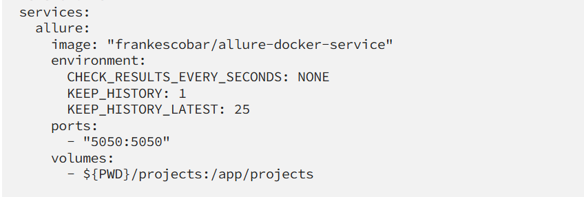

--Step 1--
1.Use the below docker-cmopose-alure.yaml file to pull the image.

2. docker compose -f docker-compose-allure.yaml up -d
3. check the report to verify server is up or not
 http://localhost:5050/allure-docker-service/projects/default/reports/latest/index.html
4. Then create on Project id using the allure api, for that i have created one class AllureUploadOkHttp in com.runner package ref that
5. In the class file i have created three methods, one to create Project id, upload to allure and generate report.
6. Run the class and update the report path, it shoudl work fine.
7. this is the e.g for report link for pertcular module
   http://localhost:5050/allure-docker-service/projects/rd-all-modules/reports/latest/index.html#
8. Also it has API, you can check that http://localhost:5050/allure-docker-service/ it open swgger there we have all the details

