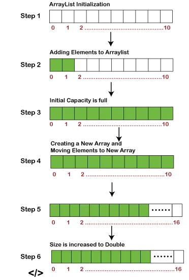
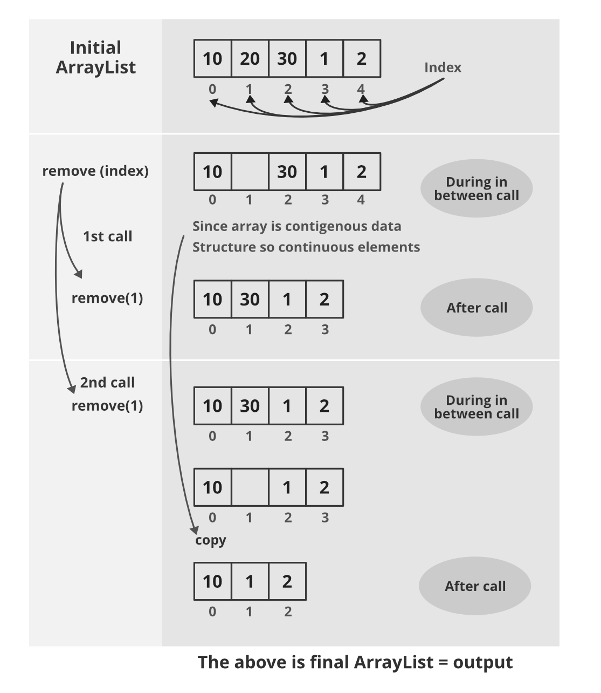
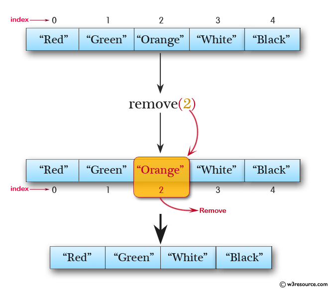
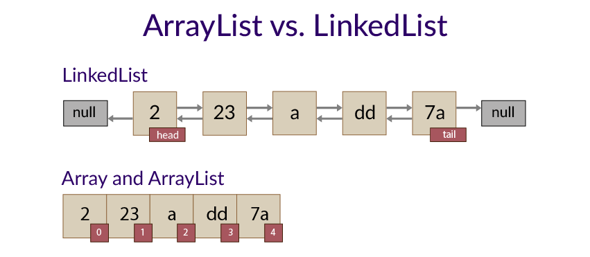
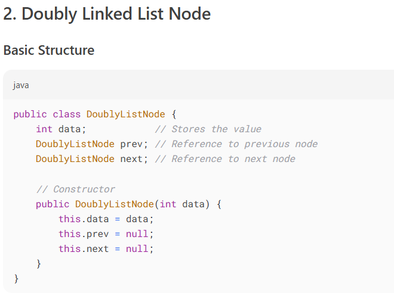
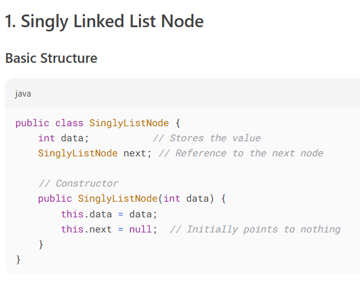

# Internal working of Arrayslist

Array Initialization

Add and remove

1. *Singly Linked List*
   Structure:
Each node contains:
Data
A single pointer/reference to the next node
The last node points to null
Head -> [A|next] -> [B|next] -> [C|next] -> null

2. *Doubly Linked List*
   Structure:
Each node contains:
Data
Pointer to the next node
Pointer to the previous node
Head's previous points to null
Tail's next points to null
   null <-> [A|prev|next] <-> [B|prev|next] <-> [C|prev|next] <-> null

