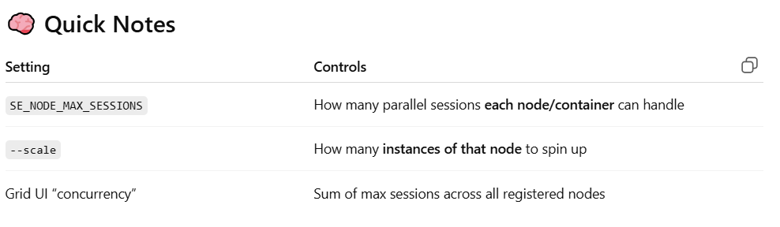

# SeleniumBDDProject
Selenium BDD Cucumber framework

[//]: # (Docker Setup)
1. install docker desktop
2. Enable the vitualization from BIOS if not enabled
   Restart and Enter BIOS/UEFI(press the BIOS key repeatedly F10) -> navigate to the Advanced, CPU Configuration, or System Configuration tab ->
   Intel Virtualization Technology , VT-x,Intel VT-d ,SVM Mode -> Enable the Setting ->  Verify Virtualization is Enabled in Windows (Task mnager CPU section)
3. docker compose -f selenium-grid.yaml up -d (use this when file is different from docker-compose.yaml)
4. docker compose up -d --scale chrome=2 --scale edge=1 --scale firefox=1  (use this to scale, if you are using just compose then only one instance is used)
5. http://localhost:5555 (to check Grid is up or not)
6. To view the UI, click video icon from selenium grid and enter the passwod as "secret".

