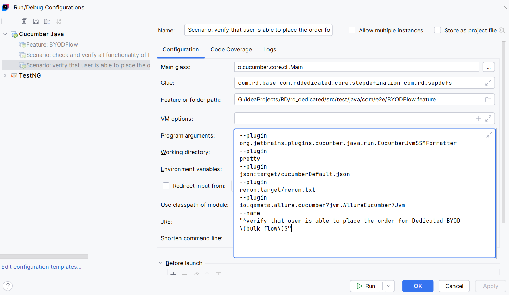

-- TO execute cucmber we need to install cucumber java plugin
after that we need to configure in the run configuration if intellij
erlier to generate allure report we need to run the RunnerTest class
but by using the below configuration we can run as the time of feature files. 

